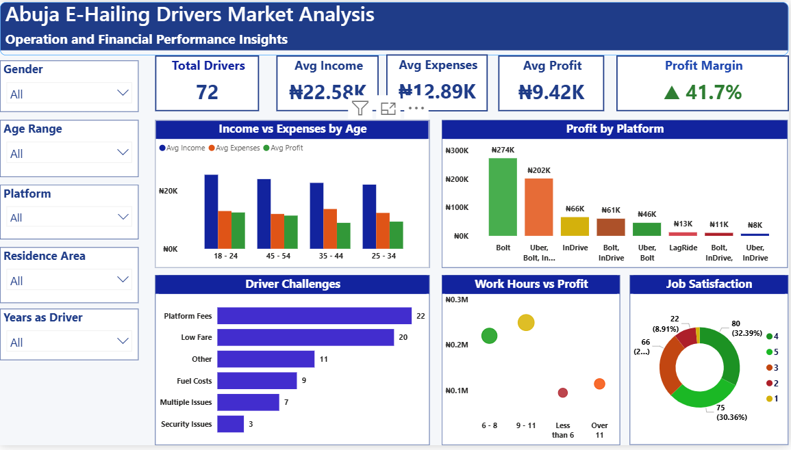
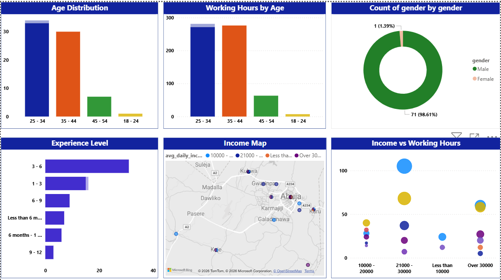

# Abuja-E-Hailing-Market-Analysis
📊 End-to-end analysis of the e-hailing market in Abuja, Nigeria. Featuring a Power BI dashboard exploring driver profitability, operational bottlenecks, and the "sweet spot" for daily earnings. Includes Python data cleaning and actionable business recommendations.

# 📊 Dashboard Overview

##📌 Project Overview
The e-hailing ecosystem in Abuja operates within a highly competitive and cost-sensitive environment, where drivers continuously balance rising operational expenses against platform commission structures.
This project analyzes survey responses from 72 e-hailing drivers to identify the primary drivers of profitability and operational efficiency.
The objective is to generate data-driven insights that support drivers in optimizing earnings while providing stakeholders with a clearer understanding of the structural economic pressures within the gig economy.

## 👥 Driver Demographics & Experience
Understanding the workforce behind the apps.

##🎯 Objectives of the Analysis
Identify key factors influencing driver profitability in Abuja’s e-hailing market
Evaluate the relationship between working hours and earnings efficiency
Assess the impact of multi-platform usage (multi-homing) on income stability
Quantify the effect of major cost drivers such as fuel and platform commissions
Provide actionable recommendations to improve driver earnings and sustainability

##📊 Key Insights & Findings
1. Profitability Reality Gap
While the average profit margin stands at 41.7%, actual daily net earnings average approximately ₦9.42K, highlighting a significant gap between percentage margins and absolute take-home income after operational expenses.
2. Optimal Productivity Window
Driver efficiency peaks between 6–11 working hours daily. Beyond 11 hours, marginal earnings decline due to fatigue, higher fuel consumption, and reduced ride efficiency.
3. Multi-Homing Advantage
Drivers operating across multiple platforms (Bolt, Uber, inDrive) consistently report higher cumulative earnings compared to single-platform drivers, indicating reduced idle time and improved ride access.
4. Dominant Cost Pressure Points
Fuel expenditure and platform commission fees remain the most significant constraints on profitability, collectively eroding a substantial portion of gross earnings.
🛠️ Tools & Technologies
Power BI – Dashboard design, KPI tracking, interactive visual analytics, DAX measures
Python (Pandas) – Data cleaning, preprocessing, and transformation
Microsoft Excel – Structured data collection and initial validation

## 🛠️ Tech Stack & Tools

* **Data Visualization:**
    * **Power BI:** Developed interactive dashboards and utilized DAX for financial metrics (Profit Margin, Average Income).
* **Data Processing:**
    * **Python (Pandas):** Performed data cleaning, handled missing values, and transformed survey data.
* **Data Storage:**
    * **Microsoft Excel:** Initial data structuring and survey response storage.
* **Project Management:**
    * **GitHub:** Version control and project documentation.

## 🏗️ Project Workflow
1. **Data Cleaning:** Python was used to normalize income figures and group age ranges.
2. **Analysis:** Identified the "Golden Window" (6–11 hours) for maximum driver ROI.
3. **Visualization:** Built a star-schema model in Power BI to link demographics to profitability.

##📂 Repository Structure

├── Data/                   # Cleaned datasets used for analysis
├── Notebooks/             # Python scripts for data cleaning and preprocessing
├── Visuals/               # Dashboard screenshots and report exports
├── Abuja_E-Hailing.pbix   # Power BI dashboard file
└── README.md              # Project documentation

###💡 Recommendations
1. Optimize Working Hours Strategy
Drivers should prioritize the 6–11 hour window where earnings efficiency is highest, rather than extending shifts into low-return hours that increase fatigue and reduce net gains.
2. Adopt Multi-Platform Operations
Engaging multiple ride-hailing platforms improves trip frequency and reduces idle time, leading to higher overall daily revenue stability.
3. Fuel Cost Optimization Practices
Drivers should consider fuel-efficient route planning, bulk fueling strategies, and vehicle maintenance routines to reduce unnecessary fuel wastage.
4. Commission Awareness & Strategy
Drivers should actively track platform commission structures and prioritize platforms or time windows that yield higher net returns after deductions.
5. Policy & Stakeholder Insight (for platforms/regulators)
There is a clear need for more balanced commission structures and driver support mechanisms to ensure long-term sustainability within the gig economy.

